# Church TrueNAS infrastructure

## First time install

Paste this prompt to AI

```
Implement: .cursor/skills/first-install/SKILL.md
```

How-to pages: [docs/installation_guide](docs/installation_guide/01-router-portforward.md).

## Main Idea:

• Easy to maintain & share with other churches  
• Automatic & fail proofed  
• Well documented & structured to works efficiently by using AI  

## Docs layout


| Layer             | Path                                | What                                                                                       |
| ----------------- | ----------------------------------- | ------------------------------------------------------------------------------------------ |
| Global / reusable | `{app}/README.md` + `{app}/docs/`   | Same on every instance: deploy, SSO how-to, scripts                                        |
| This instance     | `instance/{app}/Readme.md`          | Ports, HostPath, Authentik slug, live notes                                                |
| Secrets           | `instance/{app}/.env` + `.env.oidc` | Never print. Shared: `instance/caddy/.env`, `instance/email/.env`, `instance/truenas/.env` |
| ToDos             | `todo/{app}`                        | To do plans                                                                                |
| Cross-app         | `docs/`                             | Install guide, networking                                                                  |


• When working on an app: read `{app}/README.md` **and** `instance/{app}/Readme.md`, `todo/{app}`
• This infra's instance documentation & secrets — [Instance Readme](instance/Readme.md)

## Global

• Infra installation guide: [docs/installation_guide](docs/installation_guide/01-router-portforward.md)
• Networking: [docs/networking.md](docs/networking.md)
[Network variables](instance/caddy/.env) (eg `NEXTCLOUD_DOMAIN` & `NEXTCLOUD_UPSTREAM`)

```mermaid
flowchart TD
    Internet -->|"TCP 80/443 + UDP 443"| Router
    Router -->|"HTTPS 1,2,3"| Caddy["Caddy<br/>CrowdSec"]

    subgraph BEHIND_CADDY["Caddy & CrowdSec"]
        Caddy -->|"NEXTCLOUD_DOMAIN"| NextcloudAIO["<b>Nextcloud</b><br/>Center point of user workflows<br/><i>NEXTCLOUD_UPSTREAM</i>"]
        Caddy -->|"AUTH_DOMAIN"| Authentik["<b>Authentik</b><br/>IDP & SSO<br/><i>AUTHENTIK_UPSTREAM</i>"]
        Caddy -->|"N8N_DOMAIN"| n8n["<b>n8n</b><br/>Center of automations<br/><i>N8N_UPSTREAM</i>"]
        Caddy -->|"FILEFLOWS_DOMAIN"| FileFlows["<b>FileFlows</b><br/>n8n integration for Media automations<br/><i>FILEFLOWS_UPSTREAM</i>"]
        Caddy -->|"HANDBRAKE_DOMAIN"| HandBrake["<b>HandBrake</b><br/>Manual Media conversions<br/><i>HANDBRAKE_UPSTREAM</i>"]
        Caddy -->|"GIT_DOMAIN"| Gitea["<b>Gitea</b><br/>Git / Actions<br/><i>GIT_UPSTREAM</i>"]
        Gitea -->|"GIT_DOMAIN"| Gitea_Runner["<b>Gitea Act Runner</b><br/>CI runners<br/><i>no public port; talks to Gitea</i>"]
        Caddy -->|"WORDPRESS_DOMAIN"| Wordpress["<b>Wordpress</b><br/>Public website<br/><i>WORDPRESS_UPSTREAM</i>"]
        Caddy -->|"NOCODB_DOMAIN"| NocoDB["<b>NocoDB</b><br/>Content manager for websites<br/><i>NOCODB_UPSTREAM</i>"]
        Caddy -->|"NETBIRD_DOMAIN"| Netbird["<b>Netbird Server</b><br/>VPNs & dashboard<br/>SPA <i>NETBIRD_UPSTREAM</i> + gRPC <i>NETBIRD_MGMT_UPSTREAM</i>; STUN :30417"]
        Caddy -->|"POSTIZ_DOMAIN"| Postiz["<b>Postiz</b><br/>Social scheduling church + Bless Time<br/><i>POSTIZ_UPSTREAM</i>"]
        Caddy -->|"TANDOOR_RECIPES_DOMAIN"| Tandoor["<b>Tandoor Recipes</b><br/>Family recipes; OIDC, no Caddy FA<br/><i>TANDOOR_RECIPES_UPSTREAM</i>"]
        Caddy -->|"HOMEBOX_DOMAIN"| HomeBox["<b>HomeBox</b><br/>Inventory; OIDC, no Caddy FA<br/><i>HOMEBOX_UPSTREAM</i>"]
        Caddy -->|"GRAMPS_DOMAIN"| Gramps["<b>Gramps Web</b><br/>Genealogy; OIDC, multi-tree, no Caddy FA<br/><i>GRAMPS_UPSTREAM</i>"]
    end

    subgraph LAN["LAN Only"]
        Dockge["<b>Dockge</b><br/>Non TrueNAS-native apps manager<br/>:8443"]
        NEXTCLOUD_MCP["<b>Nextcloud MCP</b><br/>:31800"]
        AdguardHome["<b>AdguardHome</b><br/>Local DNS rewrites<br/>:30004"]
    end

    subgraph HOST["Hosts"]
        Proxmox["<b>Proxmox</b><br/>Host hypervisor<br/>PVE_URL :8006"]
        TrueNAS["<b>TrueNAS</b><br/>NAS + Apps<br/>TRUENAS_URL :880/8443"]
        Proxmox -->|"VM 100"| TrueNAS
    end

    %% Application global & instance documentation
    click Caddy "caddy/README.md" "instance/caddy/Readme.md"
    click NextcloudAIO "master-nextcloud-aio/README.md" "instance/master-nextcloud-aio/Readme.md"
    click Authentik "authentik/README.md" "instance/authentik/Readme.md"
    click n8n "n8n/README.md" "instance/n8n/Readme.md"
    click FileFlows "fileflows/README.md" "instance/fileflows/Readme.md"
    click HandBrake "handbrake/README.md" "instance/handbrake/Readme.md"
    click Gitea "gitea/README.md" "instance/gitea/Readme.md"
    click Gitea_Runner "gitea-runner/README.md" "instance/gitea-runner/Readme.md"
    click Wordpress "wordpress/README.md" "instance/wordpress/Readme.md"
    click NocoDB "nocodb/README.md" "instance/nocodb/Readme.md"
    click Netbird "netbird-server/README.md" "instance/netbird-server/Readme.md"
    click Postiz "postiz/README.md" "instance/postiz/Readme.md"
    click Tandoor "tandoor-recipes/README.md" "instance/tandoor-recipes/Readme.md"
    click HomeBox "homebox/README.md" "instance/homebox/Readme.md"
    click Gramps "gramps-web/README.md" "instance/gramps-web/Readme.md"
    click Dockge "dockge/README.md" "instance/dockge/Readme.md"
    click NEXTCLOUD_MCP "nextcloud-mcp/README.md" "instance/nextcloud-mcp/Readme.md"
    click AdguardHome "adguardhome/README.md" "instance/adguardhome/Readme.md"
    click TrueNAS "truenas/README.md" "instance/truenas/Readme.md"
    click Proxmox "proxmox/README.md" "instance/proxmox/Readme.md"
```




## Agent skills

• Custom / app skills: `.cursor/skills/` (Authentik, TrueNAS, Dockge)
• Ecosystem skills (`npx skills add`, no `-g`): `.agents/skills/` + lock `skills-lock.json`
• Restore: `npx skills experimental_install`


| Skill                               | Source                                | Use                                                                                                                                                                       |
| ----------------------------------- | ------------------------------------- | ------------------------------------------------------------------------------------------------------------------------------------------------------------------------- |
| truenas-scale                       | custom (`.cursor/skills/`)            | TrueNAS API via `tn-ws.mjs` / `tn-rest.mjs` / `tn-put.mjs`; Dockge list/update. Creds: `instance/truenas/.env`                                                            |
| authentik                           | custom (`.cursor/skills/`)            | Always when working on Authentik. Run `scripts/` (users/groups/OIDC/tokens/`api.py`); never ad-hoc curl. Creds: `instance/authentik/.env` + `instance/caddy/.env`         |
| dockge-docker-compose-stack-manager | lobehub `agentskillexchange-skills-…` | Dockge stacks: `scripts/dockge-start.mjs` list/start/status/get/down                                                                                                      |
| find-skills                         | `vercel-labs/skills`                  | Discover/install skills from [skills.sh](https://skills.sh/). Search: `npx skills find [query]`. Add: `npx skills add owner/repo --skill name -y` (omit `-g` = this repo) |
| using-n8n-skills-official           | `n8n-io/skills`                       | n8n MCP/workflows — load this first; routes to the other 13 `n8n-*-official` skills                                                                                       |
| home-assistant-best-practices       | `homeassistant-ai/skills`             | HA automations, helpers, dashboards, YAML-only integrations. Load when editing HA config                                                                                  |
| fileflow-pathologize                | `spf13/go-skills`                     | Safe Go file move/copy/rename (`fileflow`) + OS-safe names (`pathologize`). Refs in SKILL.md                                                                              |
| wordpress-pro                       | `jeffallan/claude-skills`             | WP themes/plugins/Gutenberg/Woo/REST, WPCS, nonces/sanitize/escape. Refs: `.agents/skills/wordpress-pro/references/`                                                      |
| wp-plugin-directory-guidelines      | `wordpress/agent-skills`              | WordPress.org plugin directory 18 guidelines, GPL, naming. Refs: `.agents/skills/wp-plugin-directory-guidelines/references/`                                              |


